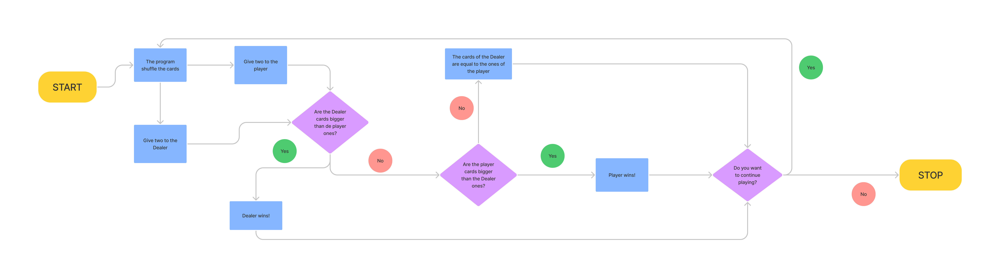

# Blackjack-game

Mi dirección de GitHUb para este repositorio es la siguiente: [GitHub](https://github.com/andmansim/Blackjack-game.git)
https://github.com/andmansim/Blackjack-game.git

Hemos resuelto un juego parecido al Blackjack.
El diagrama de flujo de nuestro código es el siguiente: 

```
cards = {chr(0x1f0a1): 11, chr(0x1f0a2): 2, chr(0x1f0a3): 3, chr(0x1f0a4): 4, chr(0x1f0a5): 5, chr(0x1f0a6): 6, chr(0x1f0a7): 7, chr(0x1f0a8): 8, chr(0x1f0a9): 9, chr(0x1f0aa): 10, chr(0x1f0ab): 10, chr(0x1f0ad): 10, chr(0x1f0ae): 10 }
deck = [chr(x) for x in range (0x1f0a1, 0x1f0ae)] 
    
def new_game(deck3):
    print("Values cards are:") 
    print (cards)
    mix_cards(deck3)
    total_player = distribute_cards(deck3) + distribute_cards(deck3)
    total_dealer = distribute_cards(deck3) + distribute_cards(deck3)

    print ("Cards player value: " , total_player)
    print ("Cards dealer value: " , total_dealer)

    if total_player < total_dealer:
        print("Dealer wins!")
    elif total_player > total_dealer:
        print("You win!")
    else:
        print("You tie with the Dealer")
        
def mix_cards (deck2):
    from random import shuffle
    shuffle(deck2)
    print(deck2)
    

def distribute_cards (deck1):
    card1 = deck1[0]
    print(card1)
    value1 = cards[card1]
    print (value1)
    deck1 += [deck1.pop(0)]
    deck1.pop()
    print (deck1)
    return value1

new_game(deck) 
answer = "Y"
while answer == "Y":
    print("Do you want to continue playing?: Y/N")
    answer = input() 
    if answer == "Y":
        cards = {chr(0x1f0a1): 11, chr(0x1f0a2): 2, chr(0x1f0a3): 3, chr(0x1f0a4): 4, chr(0x1f0a5): 5, chr(0x1f0a6): 6, chr(0x1f0a7): 7, chr(0x1f0a8): 8, chr(0x1f0a9): 9, chr(0x1f0aa): 10, chr(0x1f0ab): 10, chr(0x1f0ad): 10, chr(0x1f0ae): 10 }
        deck = [chr(x) for x in range (0x1f0a1, 0x1f0ae)] 
        new_game(deck)

